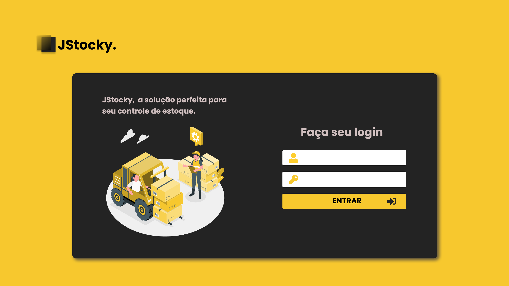

<h1 align="center">
	
	
Controle seu estoque com o Jstocky 📦

</h1>

<h1 align="center">
	
</h1>

## 📕 Sobre

Esse projeto foi desenvolvido por mim durante o terceiro semestre do curso Engenharia de Software, foi feito no intuíto da aprendizagem na linguagem PHP.

##  📦 Onde o Jstocky pode ser aplicado?

Esse projeto tem como objetivo, controlar o estoque de pequena empresa, possibilitando o cadastro de seus produtos, a edição dos mesmo, alterando quantidade, descrição, preço e valor. Também, o projeto também gera um relatório que informa os produtos que estão com as quantidades abaixo do ideal, ajudando então a manuteção do estoque.

## 🔨 Tecnologias

- [PHP](https://www.php.net/)
- [JavaScript](https://#)
- [HTML](https://reactnative.dev)
- [CSS](https://#)
- [SCSS](https://sass-lang.com/)
- [Mysql](https://www.mysql.com/)

## 📜 License

Este projeto está sob a licença do MIT. Veja o arquivo LICENÇA para maiores detalhes.
